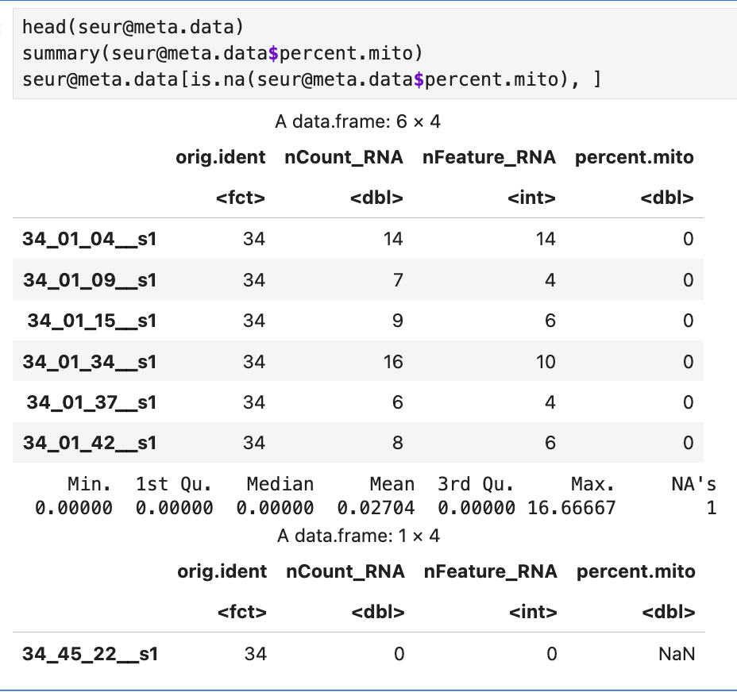

Nov 11, 2025

Error message were encountered during execution: 

The reason is that the filtering step failed because no cells passed the mitochondrial percentage filter. The log output is as follows:

```
Detected ParseBio format.
             orig.ident nCount_RNA nFeature_RNA percent.mito
34_01_04__s1         34        146          140    0.0000000
34_01_09__s1         34        116          110    0.0000000
34_01_15__s1         34         77           74    0.0000000
34_01_34__s1         34        129          118    0.7751938
34_01_37__s1         34        103           98    0.0000000
34_01_42__s1         34         94           87    0.0000000
   Min. 1st Qu.  Median    Mean 3rd Qu.    Max. 
 0.0000  0.0000  0.0000  0.2811  0.0000 10.0000 
Warning: Default search for "data" layer in "RNA" assay yielded no results; utilizing "counts" layer instead.
null device 
          1 
null device 
          1 
[1] 0
      Doublets Poor-Quality Mitochondrial Total Filtered
scRNA      761            0         15054          15196
Error in `subset()`:
! No cells found
Backtrace:
    ▆
 1. ├─base::subset(seur, subset = percent.mito < mito.upper.limit)
 2. └─SeuratObject:::subset.Seurat(seur, subset = percent.mito < mito.upper.limit)
 3.   └─rlang::abort(message = "No cells found")
Execution halted
```

There is one cell without any reads. To fix this, we change the --min.cells from default 0 to 1 and min.features from default 0 to 1 in seurat script. 

